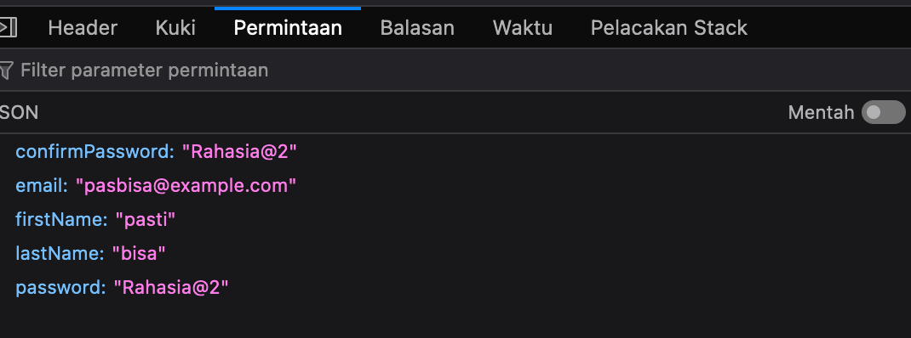

# How to Run

## Backend

1. go to folder `backend`
2. install packages, run `npm i`
3. created `.env` file based on the example
   1. pdate mongodb password connection
   2. update JWT_SECRET_KEY. we can use https://randomkeygen.com
4. run `npm run dev`

## Frontend

1. go to folder `frontend`
2. install package, run `npm i`
3. created `.env` based on the example and adjust accordingly
4. run `npm run dev`

# setup project

## backend

1. create folder called `backend`
2. run `npm init`
3. run `npm i express dotenv cors mongodb mongoose`
4. run `npm i nodemon typescript ts-node @types/mongodb @types/cors @types/express`

## frontend

1. delete folder frontend if necessary
2. run `npm create vite@latest`
3. input `frontend` as name project, choose `react` and `Typescript + SWC`

## mongodb

1. login to https://cloud.mongodb.com/
2. create new database
3. create env for MONGGODB_CONNECTION_STRING
4. update backend to acccept connection string

## tailwind

1. go to frontend, run `npm install -D tailwindcss postcss autoprefixer`
2. run `npx tailwindcss init -p`

# Note

- why SWC? because it make build faster 2JuONRtcGpl0XGuk
- [BUG] [Express.js] password validator too strong and doesn't complain if the requirement not satisfy
- [BUG] [frontend] password can be seen at inspect browser 
-
